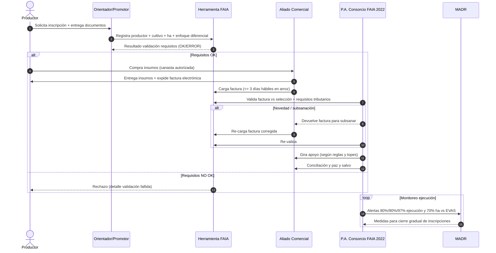
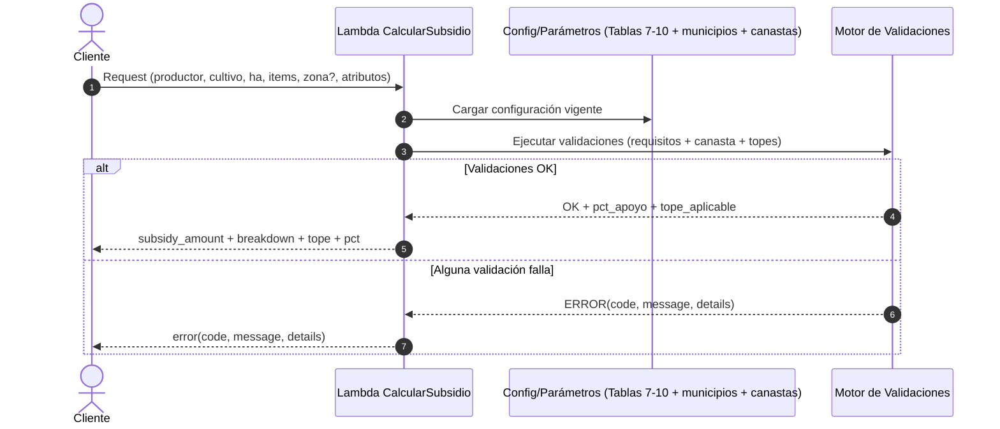

---

## 1) Qué es el programa y qué debe soportar el sistema

**Objetivo del FAIA Integral 2026**: otorgar un **apoyo económico** para compra de insumos (semillas, material vegetal, fertilizantes, enmiendas, orgánicos/acondicionadores, bioinsumos y plaguicidas permitidos) a **pequeños productores** de cadenas priorizadas, e incluir **medianos** únicamente en **arroz**.  

**Ejecución**: etapas “**cíclicas**” durante **7 meses o hasta agotar recursos**. 

**Recursos**: total **$32.136.000.000**, con **tope de costos operativos 9,97%** del total; recursos priorizados: **arroz $5.000.000.000** y **papa $8.000.000.000** (redistribuibles si la demanda no se cumple). 

**Focalización territorial**: lista de **municipios focalizados (Divipola)** + **parágrafo con “otros municipios” solo para arroz**.  

---

## 2) Actores y responsabilidades (para entender flujos)

* **Productor**: se inscribe, acredita requisitos, selecciona insumos y compra.
* **Orientador / promotor municipal**: verifica requisitos y hace seguimiento (incluye monitorear precio con descuento aplicado). 
* **Aliado comercial (almacén/punto de venta)**: vende insumos autorizados, expide factura electrónica y la carga al aplicativo; requisitos formales para habilitarse. 
* **P.A. Consorcio FAIA 2022**: valida facturas vs selección y normas tributarias; gestiona pagos y conciliación. 
* **MADR**: recibe alertas de ejecución y define medidas para cierre gradual de inscripciones. 

---

## 3) Parámetros configurables que el equipo técnico debe “bajar” a configuración

### 3.1 Parámetros “globales” del programa

* `program_duration_months`: **7** (o hasta agotamiento). 
* `total_budget`: **32136000000**. 
* `ops_cost_cap_pct`: **9.97%**. 
* `reserved_budget_by_chain`: arroz **5.000.000.000**, papa **8.000.000.000** (+ regla de redistribución). 

### 3.2 Listas maestras

* `prioritized_chains`: lista de cultivos/cadenas priorizadas (Tabla 2). 
* `focalized_municipalities_divipola`: Tabla 1. 
* `extra_municipalities_rice_only_divipola`: Parágrafo “solo arroz”. 
* `basket_allowed_items`:

  * Cadenas general (Tabla 4: semillas, material vegetal, fertilizantes químicos, enmiendas, etc.). 
  * Bioinsumos/Orgánicos (Tabla 5) con ingredientes activos. 
  * Arroz (Tabla 6). 

### 3.3 Reglas de elegibilidad (validaciones duras)

**Generales (todas excepto arroz):**

* Cédula original. 
* Certificación de pequeño productor (expedida por Secretaría/autoridad municipal). 
* Productor debe estar previamente inscrito en **SPEA** (autogestión) para validar información del certificado. 
* SISBEN **A, B o C**, excepto comunidades étnicas (aceptan listado censal MinInterior si no hay SISBEN). 
* No haber sido beneficiario de otro programa del MADR operado por el mismo / ni FAIA 2025 o vigencia actual. 

**Arroz (requisitos específicos):**

* Certificado del Auditor de la Cuota de Fomento (Fondo Nal. del Arroz) acreditando pago de cuotas parafiscales 4 años (2022–2025) y topes de hectáreas reportadas (máx 13,3 pequeño; 40 mediano). 
* Certificación de intención de siembra (trámite ICA) sin superar 13,3 ha pequeño y 40 ha mediano. 
* SISBEN y “no ser beneficiario…” igual que general. 

**Enfoque diferencial**:

* Jóvenes rurales: **18 a 28 años**, mujeres y jóvenes tienen prioridad y pueden acceder a % diferencial mayor. 
* Validación operativa: sexo y edad contra documento de identidad. 

### 3.4 Clasificación de productor (para validaciones y topes)

Tabla 3 define tamaños máximos UPA (ha) por grupo para pequeño vs mediano (en arroz se admite mediano; en otras cadenas, el universo objetivo es pequeño): 

* Tubérculos y plátano: pequeño **3,6** / mediano **10,8**
* Cereales: pequeño **13,3** / mediano **40**
* Leguminosas: pequeño **12,5** / mediano **30**
* Verduras y hortalizas: pequeño **0,5** / mediano **3**
* Frutas: pequeño **3** / mediano **10**
* Caña panelera: pequeño **8** / mediano **24**
* Algodón: pequeño **25** / mediano **550**

> **Decisión técnica recomendada**: en cadenas NO-arroz, si el productor excede “pequeño”, **rechazar** (no “capar”), porque el programa se orienta a pequeños (ACFEC) y el manual separa arroz como caso especial. 

---

## 4) Reglas de cálculo del subsidio y validación de topes (lo más crítico)

### 4.1 Porcentajes de apoyo (Tabla 7)

El programa otorga apoyo sobre el valor de compra, por tipo de insumo y enfoque diferencial: 

* Síntesis química: **30%** (o **32%** mujer/joven)
* Bioinsumos + orgánicos/acondicionadores: **38%** (o **40%** mujer/joven)
* Bioinsumos **nacionales**: **48%** (o **50%** mujer/joven)

**Pago del productor (no-arroz)**: el productor paga el complemento (70/68/62/60/52/50) y el programa gira el resto al aliado comercial. 

**Arroz**: el programa “cubre el **100%** de la compra”, **respetando topes máximos según tipo de productor, hectáreas y zona**. 

---

### 4.2 Topes máximos (NO-arroz): Tabla 8

El manual define por cultivo:

* `monto_max_por_ha`
* `max_ha_a_apoyar`
* `monto_max_apoyo_por_productor` 

Valores capturados en Tabla 8 (por productor):

* Cebada: $475.223/ha; 8,87 ha; **$4.215.228** 
* Maíz: $754.431/ha; 8,87 ha; **$6.691.802** 
* Caña panelera: $689.813/ha; 8 ha; **$5.518.500** 
* Ahuyama: $1.598.400/ha; 0,5 ha; **$799.200** 
* Cebolla bulbo: $1.598.400/ha; 0,5 ha; **$799.200** 
* Cebolla rama: $2.400.000/ha; 0,5 ha; **$1.200.000** 
* Tomate: $2.000.000/ha; 0,5 ha; **$1.000.000** 
* Lechuga: $1.800.000/ha; 0,5 ha; **$900.000** 
* Zanahoria: $1.800.000/ha; 0,5 ha; **$900.000** 
* Habichuela: $283.850/ha; 4,17 ha; **$1.183.654** 
* Arveja: $1.112.872/ha; 4,17 ha; **$4.640.677** 
* Frijol: $1.112.872/ha; 4,17 ha; **$4.640.677** 
* Soya: $808.965/ha; 4,17 ha; **$3.373.382** 
* Algodón: $525.000/ha; 8,33 ha; **$4.373.250** 
* Ñame / Papa / Plátano / Yuca / Arracacha: $700.210/ha; 3,6 ha; **$2.520.757** 
* Melón / Patilla: $624.193/ha; 3 ha; **$1.872.578** 

**Regla técnica de tope (NO-arroz)**
Para una solicitud con total de compra `total_compra` y porcentaje `pct_apoyo`:

* `subsidio_teorico = total_compra * pct_apoyo`
* `tope = monto_max_apoyo_por_productor` (según cultivo)
* **Validación dura**: si `subsidio_teorico > tope` ⇒ **rechazar** (“superó topes”), porque tu requerimiento funcional lo pide y el manual define montos máximos por productor. 

> Nota: también hay control por hectáreas (`max_ha_a_apoyar`). Mi recomendación es validar **(hectareas_reportadas ≤ max_ha_a_apoyar)** como regla dura (rechazo), no como “cap”, para que “nada se pase sin revisar”.

---

### 4.3 Topes máximos (ARROZ): Tablas 9 y 10 (por zona)

**Pequeños (Tabla 9)**: max ha promedio 5; tope máximo varía por zona: 

* Llanos: **$3.120.000**
* Bajo Cauca: **$2.340.000**
* Costa Norte: **$3.660.000**
* Centro: **$4.380.000**
* Santanderes: **$3.360.000**

**Medianos (Tabla 10)**: max ha promedio 11; tope máximo por zona: 

* Llanos: **$4.461.600**
* Bajo Cauca: **$3.346.200**
* Costa Norte: **$5.233.800**
* Centro: **$6.263.400**
* Santanderes: **$4.804.800**

El manual aclara que los montos máximos dependen de ha reportadas **sin superar** máximos y explica el cálculo (hectáreas, producción promedio, toneladas, apoyo a comercialización, etc.).  

**Regla técnica de tope (ARROZ)**

* `pct_apoyo = 100%` (el programa cubre 100% de la compra) 
* `tope = tabla9_o_10[zona][tipo_productor]`
* Si `total_compra > tope` ⇒ **rechazo** por exceder tope (según tu requerimiento de robustez).

---

## 5) Validaciones operativas adicionales (para robustez y pruebas)

### 5.1 Validación de canasta y restricciones

* Todo producto comprado debe tener **registro ICA**. 
* Se restringe compra de plaguicidas químicos de **categoría toxicológica I y II**; se incentivan III y IV (CAN 2075). 
* Bioinsumos: validación por registros ICA / productor nacional / etc. (criterio para % mayor). 

### 5.2 Flujo de compra y facturación (para pruebas end-to-end)

* La inscripción y compra se hace en el municipio del productor; si no hay almacenes, puede comprar en el municipio más cercano con aliado habilitado. 
* Aliado comercial debe estar habilitado y cumplir requisitos (6 meses de constitución, Cámara de Comercio ≤30 días, facturador electrónico, RUT, certificación bancaria ≤30 días, inventario y registros ICA). 
* Arroz: aliado entrega según selección hecha en inscripción, expide factura electrónica con requisitos art. 617 ET y la carga en la herramienta **máximo 3 días hábiles** tras entrega. 
* Validación/subsanación: el Consorcio compara selección vs facturado y valida requisitos tributarios; si hay novedad, devuelve factura para subsanar. 
* Tras aprobación: liquidación y pago al aliado, conciliación y paz y salvo. 

### 5.3 Cierre de inscripciones (control presupuestal)

* Monitoreo permanente; al alcanzar **80%, 90% y 97%** de ejecución se informa al MADR para cierre gradual por municipio. 
* Alertas si en un municipio se supera **70%** del número de hectáreas vs EVAS 2024; se aplican medidas que MADR determine. 

---

## 6) Rutas lógicas (escenarios) para que el equipo técnico implemente y pruebe

Te lo dejo como “árbol” de decisión mínimo (cada hoja es un caso de prueba):

### Ruta A — No-arroz, pequeño productor, todo OK

1. Validar municipio focalizado (Tabla 1).
2. Validar requisitos: cédula, certificado pequeño productor, SPEA, SISBEN/étnico, no beneficiario FAIA 2025.
3. Validar enfoque diferencial (mujer/joven 18–28) si aplica.
4. Validar selección de insumos ∈ canasta y restricciones (ICA + no tox I/II).
5. Calcular `pct_apoyo` según tipo insumo y diferencial.
6. Calcular `subsidio_teorico = total * pct_apoyo`.
7. Validar `subsidio_teorico <= tope_tabla8[cultivo]`.
8. Si pasa: responder subsidio + cuánto paga productor.

### Ruta B — Rechazo por tope (la que más deben testear)

* Todo igual a A, pero `subsidio_teorico > tope` ⇒ **error**: `TOPE_EXCEDIDO` + detalle (cultivo, tope, valor calculado, hectáreas, pct).

### Ruta C — Rechazo por hectáreas

* `hectareas_reportadas > max_ha_a_apoyar (Tabla 8)` o supera el tamaño de UPA “pequeño” (Tabla 3 en no-arroz) ⇒ error `HECTAREAS_EXCEDIDAS`.

### Ruta D — Arroz pequeño/mediano OK (100% con tope)

1. Validar municipio focalizado o “extra solo arroz”.
2. Validar certificados arroz (cuotas 2022–2025 + intención de siembra ICA).
3. Determinar tipo productor (pequeño/mediano).
4. Determinar zona (Llanos, Bajo Cauca, Costa Norte, Centro, Santanderes).
5. `pct_apoyo=100%`, `tope=tabla9/10`.
6. Validar total compra ≤ tope ⇒ OK.

### Ruta E — Factura no corresponde a selección / canasta

* En etapa de facturación: mismatch selección vs factura ⇒ devolver para subsanar (`FACTURA_NO_CORRESPONDE`). 

### Ruta F — Factura tardía (arroz)

* `fecha_carga - fecha_entrega > 3 días hábiles` ⇒ rechazo o novedad (`FACTURA_FUERA_DE_TIEMPO`). 

---

## 7) Diagrama de secuencia (Mermaid)

### 7.1 Secuencia “macro” del programa (inscripción → compra → pago)

### 7.2 Secuencia específica del cálculo (Cliente → Lambda → Config → Respuesta)

---

## 8) Documentación técnica mínima (para que cualquiera entienda y el equipo pruebe)

### 8.1 Propuesta de contrato de entrada (input) para cálculo

Campos recomendados:

* **Identidad y focalización**

  * `producer_id`, `document_number`
  * `divipola_municipio`
  * `chain` / `crop`
  * `hectares_reported`
  * `is_rice` (bool), `rice_zone` (si aplica)
* **Elegibilidad**

  * `sisben_category` (A/B/C/None)
  * `is_ethnic_group` + `has_ethnic_census_list`
  * `spea_registered` (bool)
  * `not_beneficiary_2025_or_current` (bool)
  * `sex`, `birth_date` (para mujer/joven 18–28)
  * `certificates`: objetos por tipo (general o arroz)
* **Compra**

  * `items[]`: `{sku, category, quantity, unit_price, is_bioinsumo, is_national_bioinsumo, ica_registry_ok, pesticide_toxic_category}`

### 8.2 Salida (output)

* Si OK:

  * `subsidy_amount`
  * `producer_pays_amount` (no-arroz)
  * `program_pays_amount`
  * `support_percent_applied`
  * `max_support_cap_applied`
  * `validation_trace[]` (checklist)
* Si error:

  * `error.code` (ej: `TOPE_EXCEDIDO`, `MUNICIPIO_NO_FOCALIZADO`, `SISBEN_NO_VALIDO`, `CANASTA_INVALIDA`, `PLAGUICIDA_RESTRINGIDO`, etc.)
  * `error.message`
  * `error.details` (valores calculados, tope, regla exacta que falló)

### 8.3 Reglas de oro de validación (para “nada se pase”)

1. **Primero elegibilidad**, luego canasta, luego cálculo, y **al final topes** (pero topes siempre “hard fail”).
2. Topes se validan en **dos niveles**:

   * **Topes por hectáreas** (max ha a apoyar / UPA)
   * **Topes monetarios** (máximo por productor: Tabla 8, 9, 10)
3. En arroz: `pct=100%`, pero **igual** hay tope por zona y tipo de productor.
4. En plaguicidas: si tox I/II ⇒ **rechazo inmediato**. 
---
