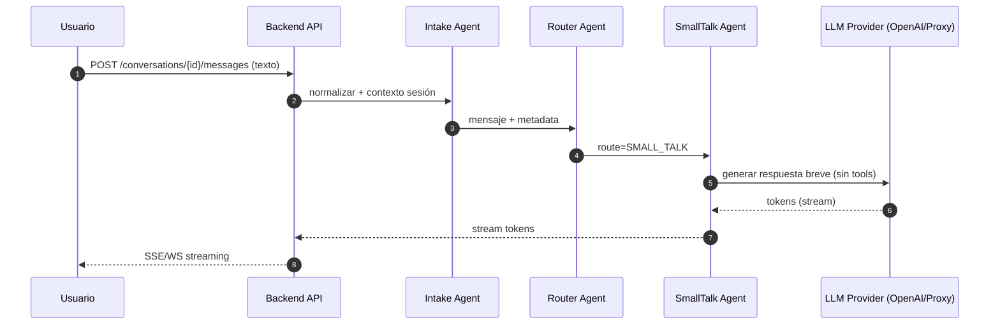
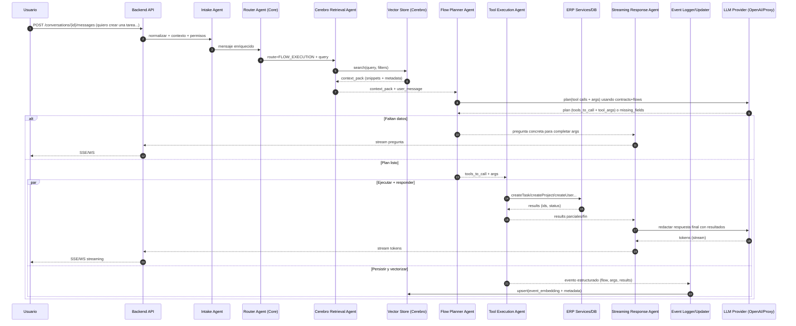

Abajo te dejo una propuesta **documentada y pensada 100% como agentes**, con contratos claros y una capa de abstracción para que hoy uses **OpenAI** y mañana puedas rutear por un **proxy (Bedrock o el que sea)** sin reescribir tu core.

---

## 1) Concepto general

Tu backend tiene un **Core Orchestrator (Router Agent)** que recibe cada mensaje y decide:

1. **Conversación simple / irrelevante para flujos**
   → Responde “ligero” (y si conviene, pide más contexto útil).

2. **Ejecución de flujo** (crear tarea/proyecto/usuario/otro)
   → Hace **RAG** contra “Cerebro” (vector store + knowledge base), **planifica** funciones, **ejecuta** herramientas y **responde en streaming**, mientras registra el evento y lo indexa en Cerebro.

---

## 2) Agentes (roles) y responsabilidades

### A. **Conversation Intake Agent**

* Normaliza input (idioma, tono, limpieza).
* Enriquecimiento mínimo (tenant, usuario, permisos, contexto de sesión).

### B. **Router / Triage Agent (Core)**

Decide una de estas rutas:

* `SMALL_TALK`: conversación simple
* `NEED_MORE_CONTEXT`: pide input más relevante
* `FLOW_EXECUTION`: requiere plan + tools
* `UNKNOWN`: fallback seguro (pedir aclaración)

> Este agente NO ejecuta herramientas. Solo enruta y define intención.

### C. **Cerebro Retrieval Agent**

* Consulta “Cerebro” (vector store) para traer:

  * contratos del API (I/O)
  * reglas de negocio
  * definición de flujos
  * ejemplos y “cómo se hace”
* Devuelve “context pack” para el Planner:

  * snippets + citas internas + metadata (scope, versión, confianza)

### D. **Flow Planner Agent**

* Con `user_message + context_pack` decide:

  * `flow_type` (CreateTask/CreateProject/CreateUser/Other)
  * `tools_to_call` (una o varias)
  * `tool_args` (o qué falta para construirlos)
* Si falta data → produce una **pregunta concreta** (no inventa).

### E. **Tool Execution Agent**

* Ejecuta herramientas de tu ERP (DB/HTTP/event bus).
* Maneja:

  * idempotencia
  * retries
  * validación de esquema
  * permisos
* Retorna resultados normalizados.

### F. **Streaming Response Agent**

* Redacta respuesta al usuario en **streaming** (SSE/WS).
* Mientras llegan resultados parciales, puede ir:

  * confirmando pasos
  * mostrando progreso
  * pidiendo missing fields si el plan lo requiere

### G. **Event Logger + Cerebro Updater Agent**

* En cada flujo exitoso:

  * guarda evento estructurado (audit/event store)
  * genera embedding + upsert a Cerebro
  * asocia el evento a conversación, tenant y entidad (task/project/user)

---

## 3) “Recursos” (prompts + contratos) como artefactos versionados

Piensa esto como **Prompt Assets** con versionado (Git / S3):

1. **System Context Prompt (Base)**

* identidad del asistente del ERP
* objetivos (resolver / ejecutar flujos)
* reglas de estilo (breve, claro, ask-if-missing)
* límites (no inventar datos de herramientas)

2. **API Contracts Pack**

* Esquemas tipo OpenAPI/JSON Schema de tus endpoints/tools
* Ejemplos I/O
* Reglas de validación

3. **Flows Pack**

* Definición de cada flujo:

  * nombre, intención, precondiciones
  * campos requeridos
  * herramientas asociadas
  * mensajes de confirmación

4. **Cerebro Knowledge Pack**

* Documentación interna (políticas, procesos, roles)
* FAQs del negocio
* “Decisiones pasadas” (eventos vectorizados)

---

## 4) Abstracción de proveedor LLM (OpenAI hoy, Bedrock/proxy mañana)

Crea una interfaz única: **LLMProvider**:

* `streamResponse(messages, tools, modelConfig) -> stream`
* `complete(messages, tools, modelConfig) -> text`
* `embed(texts) -> vectors`

Implementaciones:

* `OpenAIProvider`
* `ProxyProvider` (que hable con tu gateway → Bedrock/otro)

El Core solo conoce:

* “quiero razonar”
* “quiero embedding”
* “quiero streaming”

---

## 5) Contratos mínimos del backend (sugeridos)

* `POST /conversations` → crea conversación
* `POST /conversations/{id}/messages` → envía mensaje (modo streaming)
* `GET /conversations/{id}/events` → auditoría / timeline
* Tools internos (no necesariamente públicos):

  * `createTask(args)`
  * `createProject(args)`
  * `createUser(args)`
  * `searchCerebro(query, filters)`
  * `upsertCerebro(document)`

---

## 6) Estados del “Core” (muy simple, pero potente)

* `RECEIVED`
* `TRIAGED`
* `RETRIEVED_CONTEXT` (si aplica)
* `PLANNED`
* `EXECUTING_TOOLS`
* `STREAMING_RESPONSE`
* `PERSISTED_EVENT`
* `DONE` / `FAILED`

---

## 7) Mermaid sequence diagrams

### 7.1 Conversación simple (small talk / irrelevante)

### 7.2 Ejecución de flujo (RAG + tools + streaming + upsert en Cerebro)

---

## 8) Reglas clave (para que funcione “como ERP”, no como chat)

1. **Nunca inventar parámetros de tools.** Si falta info → pregunta concreta.
2. **Los tools son la verdad.** El LLM redacta, pero el resultado viene del ERP.
3. **Cada flujo exitoso genera “evento”** (audit + vector upsert).
4. **Cerebro no es solo documentación:** también “memoria operacional” (eventos).
5. **Streaming siempre** en flujos: progreso + confirmación + resultado.

---

## 9) Resultado práctico: cómo se vería el “routing” (modelo mental)

* Usuario: “Hola, cómo vas?” → `SMALL_TALK`
* Usuario: “Necesito crear un proyecto para el cliente X con fecha Y” → `FLOW_EXECUTION(CreateProject)`
* Usuario: “Crea una tarea” (sin detalles) → `FLOW_EXECUTION` pero Planner devuelve `missing_fields` → pregunta:
  “¿Título de la tarea, prioridad y fecha límite?”

